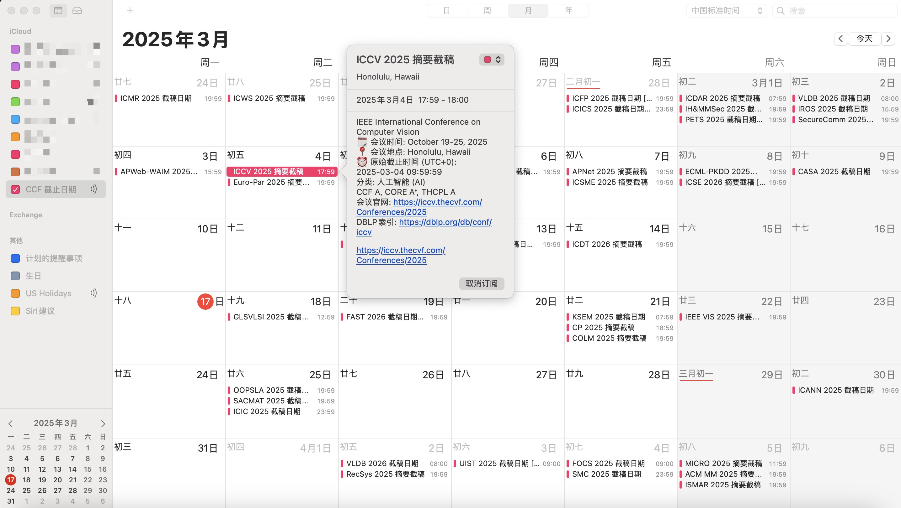

# Robotics-Deadlines

[](https://github.com/your-username/robotics-deadlines/blob/main/LICENSE)

简体中文 | [English](./README.md)

帮助机器人学研究人员追踪主要机器人学会议的截稿日期。

| <div style="width:330px">[网站预览 (主页)](https://your-username.github.io/robotics-deadlines/)</div> |
| :----: |
|  |

**对麻烦的查找会议和转换时间说拜拜!**

## iCal 订阅：

- English：`https://your-domain.com/conference/deadlines_en.ics`
- 简体中文：`https://your-domain.com/conference/deadlines_zh.ics`



## 增加/更新 会议

欢迎一起帮忙维护会议的相关信息!

增加或删除会议信息:
- Fork 这个仓库
- 增加/更新yml文件 conference/conf_type/conf_name.yml
- 提交 [pull request](https://github.com/your-username/robotics-deadlines/pulls)

## 会议录入文件

示例文件: conference/ROBO/icra.yml

```yaml
- title: ICRA
  description: IEEE International Conference on Robotics and Automation
  sub: ROBO
  rank:
    ccf: A
    core: A*
    thcpl: A
  dblp: icra
  confs:
    - year: 2024
      id: icra24
      link: https://2024.ieee-icra.org/
      timeline:
        - abstract_deadline: '2023-09-15 23:59:00'
          deadline: '2023-09-22 23:59:00'
      timezone: UTC-12
      date: May 13-17, 2024
      place: Yokohama, Japan
```

字段描述:

<table>
   <tr>
      <th colspan="3">字段名</th>
      <th>描述</th>
   </tr>
   <tr>
      <td colspan="3"><code>title</code>*</td>
      <td>缩写的会议名称, 不需要年份, 大写</td>
   </tr>
   <tr>
      <td colspan="3"><code>description</code>*</td>
      <td>介绍, 或全称, 无需第几届</td>
   </tr>
   <tr>
      <td colspan="3"><code>sub</code>*</td>
      <td>会议的类别, 可参考下面的辅助文档</td>
   </tr>
   <tr>
      <td rowspan="3"><code>rank</code>*</td>
      <td colspan="2"><code>ccf</code>*</td>
      <td>会议的等级, 示例, <code>A</code>, <code>B</code>, <code>C</code>, <code>N</code></td>
   </tr>
   <tr>
   <td colspan="2"><code>core</code></td>
   <td>会议在CORE中被标注的等级, 示例, <code>A*</code>,<code>A</code>, <code>B</code>, <code>C</code>, <code>N</code></td>
   </tr>
   <tr>
   <td colspan="2"><code>thcpl</code></td>
   <td>会议在TH-CPL中被标注的等级, 示例, <code>A</code>, <code>B</code>, <code>N</code></td>
   </tr>
   <tr>
      <td colspan="3"><code>dblp</code>*</td>
      <td>会议在dblp的URL的后缀, 示例, <code>icra</code> in https://dblp.uni-trier.de/db/conf/icra</td>
   </tr>
   <tr>
      <td rowspan="9"><code>confs</code></td>
      <td colspan="2"><code>year</code>*</td>
      <td>会议的年份</td>
   </tr>
   <tr>
      <td colspan="2"><code>id</code>*</td>
      <td>会议名字和年份, 小写</td>
   </tr>
   <tr>
      <td colspan="2"><code>link</code>*</td>
      <td>会议首页的URL</td>
   </tr>
   <tr>
      <td rowspan="3"><code>timeline</code>*</td>
      <td><code>abstract_deadline</code></td>
      <td>Abstract的截稿日期, 可选填</td>
   </tr>
   <tr>
      <td><code>deadline</code>*</td>
      <td>截稿日期, 格式为 <code>yyyy-mm-dd hh:mm:ss</code> or <code>TBD</code></td>
   </tr>
   <tr>
      <td><code>comment</code></td>
      <td>额外的一些辅助信息, 可选填</td>
   </tr>
   <tr>
      <td colspan="2"><code>timezone</code>*</td>
      <td>截稿日期的时区, 目前支持 <code>UTC-12</code> ~ <code>UTC+12</code> & <code>AoE</code></td>
   </tr>
   <tr>
      <td colspan="2"><code>date</code>*</td>
      <td>会议举办的日期, 示例, Mar 12-16, 2021</td>
   </tr>
   <tr>
      <td colspan="2"><code>place</code>*</td>
      <td>会议举办的地点, 示例, <code>city, country</code></td>
   </tr>
</table>

带星标(*)的字段是必填项。

类别匹配表:

| `sub` | 类别名称 |
| ----------- | --------------------------------------------------------- |
| `ROBO`      | 机器人学                                                  |
| `AI`        | 人工智能与机器学习                                        |
| `CV`        | 计算机视觉                                                |
| `CTRL`      | 控制系统                                                  |
| `NAV`       | 导航与定位                                                |
| `AD`        | 自动驾驶                                                  |
| `MANIP`     | 机器人操作与抓取                                          |
| `HRI`       | 人机交互                                                  |

## 许可证

基于 MIT 许可证。
